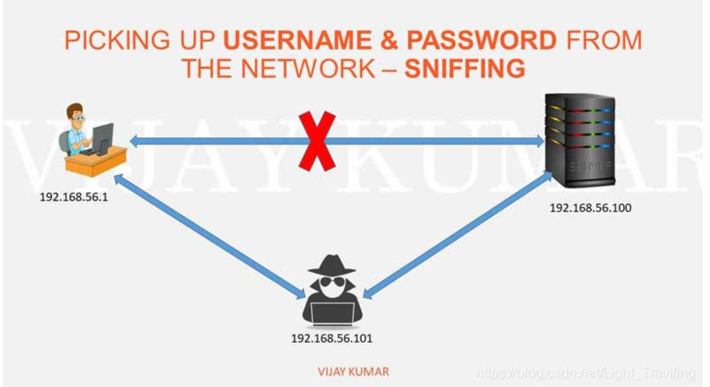
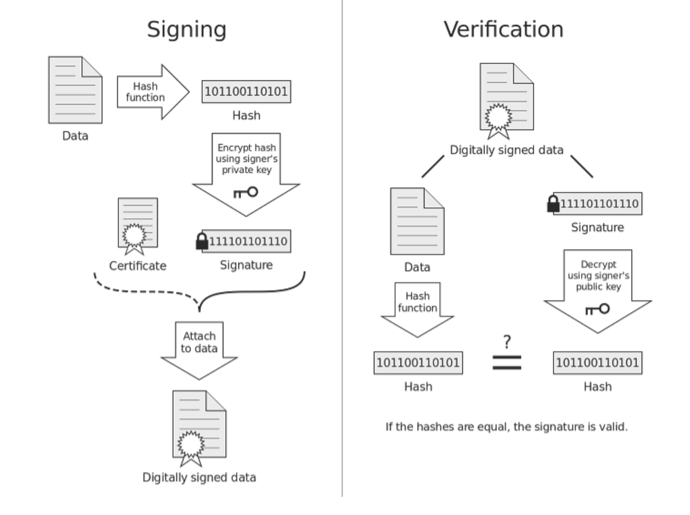

# Https

### **为什么需要加密？**

因为http的内容是明文传输的，明文数据会经过中间代理服务器、路由器、wifi热点、通信服务运营商等多个物理节点，如果信息在传输过程中被劫持，传输的内容就完全暴露了。劫持者还可以篡改传输的信息且不被双方察觉，这就是“中间人攻击”。

### **用对称加密可行吗？**

对称加密最大的问题就是密钥的传输，而密钥的传输又需要加密（反复套娃），故而单纯的对称加密是无法解决问题的。

### 用非对称加密可行吗？

鉴于非对称加密的机制，我们可能会有这种思路：服务器先把公钥以明文方式传输给浏览器，之后浏览器向服务器传数据前都先用这个公钥加密好再传，这条数据的安全似乎可以保障了！**因为只有服务器有相应的私钥能解开公钥加密的数据**。

然而反过来**由服务器到浏览器的这条路怎么保障安全？**如果服务器用它的私钥加密数据传给浏览器，那么浏览器用公钥可以解密它，而这个公钥是一开始通过明文传输给浏览器的，若这个公钥被中间人劫持到了，那他也能用该公钥解密服务器传来的信息了。所以**目前似乎只能保证由浏览器向服务器传输数据的安全性**

### 那用两组公钥私钥，是否就能保证双向传输都安全了？

1. 某网站服务器拥有公钥A与对应的私钥A’；浏览器拥有公钥B与对应的私钥B’。
2. 浏览器把公钥B明文传输给服务器。
3. 服务器把公钥A明文给传输浏览器。
4. 之后浏览器向服务器传输的内容都用公钥A加密，服务器收到后用私钥A’解密。由于只有服务器拥有私钥A’，所以能保证这条数据的安全。
5. 同理，服务器向浏览器传输的内容都用公钥B加密，浏览器收到后用私钥B’解密。同上也可以保证这条数据的安全。

然而这又引出了一个新的问题，非对称加密非常耗时，如何解决？（见RSA算法）而且这种方法真的安全了吗？

### 非对称加密 + 对称加密

1. 某网站拥有用于非对称加密的公钥A、私钥A’。
2. 浏览器向网站服务器请求，服务器把公钥A明文给传输浏览器。
3. 浏览器随机生成一个用于对称加密的密钥X，用公钥A加密后传给服务器。
4. 服务器拿到后用私钥A’解密得到密钥X。
5. 这样双方就都拥有密钥X了，且别人无法知道它。之后双方所有数据都通过密钥X加密解密即可。

这基本上就是https采用的方案了，但仍然还是有漏洞。

### 中间人攻击

中间人攻击（MITMA，man in the middle attack）
中间人攻击是一种网络攻击类型 ，应用与LAN局域网中。这种攻击的方式是 hacker 置身于两个通信 paties 之间，窃取数据。

中间人攻击允许黑客截获双方之间的数据，它可能是服务器和客户端或客户端到客户端或服务器到服务器。

如果在数据传输过程中，中间人劫持到了数据，此时他的确无法得到浏览器生成的密钥X，这个密钥本身被公钥A加密了，只有服务器才有私钥A’解开它，然而中间人却完全不需要拿到私钥A’就能干坏事了。请看：

1. 某网站有用于非对称加密的公钥A、私钥A’。
2. 浏览器向网站服务器请求，服务器把公钥A明文给传输浏览器。
3. **中间人劫持到公钥A，保存下来，把数据包中的公钥A替换成自己伪造的公钥B（它当然也拥有公钥B对应的私钥B’）**。
4. 浏览器生成一个用于对称加密的密钥X，用**公钥B**（浏览器无法得知公钥被替换了）加密后传给服务器。
5. **中间人劫持后用私钥B’解密得到密钥X，再用公钥A加密后传给服务器**。
6. 服务器拿到后用私钥A’解密得到密钥X。

这样在双方都不会发现异常的情况下，中间人掉包了服务器传来的公钥，进而得到了密钥X。**根本原因是浏览器无法确认收到的公钥是不是网站自己的，**因为公钥本身是明文传输的，难道还得对公钥的传输进行加密？这似乎变成鸡生蛋、蛋生鸡的问题了。解法是什么？

### **如何证明浏览器收到的公钥一定是该网站的公钥？**

网站是否有个‘身份证’来证明自己的公钥合法？这个‘身份证’又由谁来颁发？

**CA机构**，它是如今互联网世界正常运作的前提，而CA机构颁发的“身份证”就是**数字证书**。

#### **数字证书**

网站在使用HTTPS前，需要向**CA机构**申领一份**数字证书**，数字证书里含有证书持有者信息、公钥信息等。服务器把证书传输给浏览器，浏览器从证书里获取公钥就行了，证书就如身份证，证明“该公钥对应该网站”。

而这里又有一个显而易见的问题，“**证书本身的传输过程中，如何防止被篡改”**？即如何证明证书本身的真实性？身份证运用了一些防伪技术，而数字证书怎么防伪呢？

### **如何放防止数字证书被篡改？**

我们把证书原本的内容生成一份“签名”，比对证书内容和签名是否一致就能判别是否被篡改。这就是数字证书的“防伪技术”，这里的“签名”就叫`数字签名`：

数字签名的制作过程：

1. CA机构拥有非对称加密的私钥和公钥。
2. CA机构对证书明文数据T进行hash。
3. 对hash后的值用私钥加密，得到数字签名S。

明文和数字签名共同组成了数字证书，这样一份数字证书就可以颁发给网站了。
那浏览器拿到服务器传来的数字证书后，如何验证它是不是真的？（有没有被篡改、掉包）

浏览器验证过程：

1. 拿到证书，得到明文T，签名S。
2. 用CA机构的公钥对S解密（由于是浏览器信任的机构，所以浏览器保有它的公钥。详情见下文），得到S’。
3. 用证书里指明的hash算法对明文T进行hash得到T’。
4. 显然通过以上步骤，T’应当等于S‘，除非明文或签名被篡改。所以此时比较S’是否等于T’，等于则表明证书可信。

### **中间人有可能篡改该证书吗？**

假设中间人篡改了证书的原文，由于他没有CA机构的私钥，所以无法得到此时加密后签名，无法相应地篡改签名。浏览器收到该证书后会发现原文和签名解密后的值不一致，则说明证书已被篡改，证书不可信

### **中间人有可能把证书掉包吗？**

假设有另一个网站B也拿到了CA机构认证的证书，它想劫持网站A的信息。于是它成为中间人拦截到了A传给浏览器的证书，然后替换成自己的证书，传给浏览器，之后浏览器就会错误地拿到B的证书里的公钥了。

其实这并不会发生，因为证书一定是无法被篡改的，所以网站B掉包的一定也是正规的证书，而证书黎里包含了网站的信息，包括域名，浏览器把证书里的域名与自己请求的域名比对一下就知道有没有被掉包了。

### **为什么制作数字签名时需要hash一次？**

最显然的是性能问题，非对称加密效率较差，证书信息一般较长，比较耗时。而hash后得到的是固定长度的信息（比如用md5算法hash后可以得到固定的128位的值），这样加解密就快很多。

### **怎么证明CA机构的公钥是可信的？**

“浏览器保有它的公钥”，这是个什么保有法？怎么证明这个公钥是否可信？

让我们回想一下数字证书到底是干啥的？没错，为了证明某公钥是可信的，即“该公钥是否对应该网站”，那CA机构的公钥是否也可以用数字证书来证明？没错，操作系统、浏览器本身会预装一些它们信任的根证书，如果其中会有CA机构的根证书，这样就可以拿到它对应的可信公钥了。

实际上证书之间的认证也可以不止一层，可以A信任B，B信任C，以此类推，我们把它叫做`信任链`或`数字证书链`。也就是一连串的数字证书，由根证书为起点，透过层层信任，使终端实体证书的持有者可以获得转授的信任，以证明身份。

另外，不知你们是否遇到过网站访问不了、提示需安装证书的情况？这里安装的就是根证书。说明浏览器不认给这个网站颁发证书的机构，那么你就得手动下载安装该机构的根证书（风险自己承担XD）。安装后，你就有了它的公钥，就可以用它验证服务器发来的证书是否可信了。

### **每次进行HTTPS请求时都**必须**在SSL/TLS层进行握手传输密钥吗？**

显然每次请求都经历一次密钥传输过程非常耗时，那怎么达到只传输一次呢？

服务器会为每个浏览器（或客户端软件）维护一个session ID，在TLS握手阶段传给浏览器，浏览器生成好密钥传给服务器后，服务器会把该密钥存到相应的session ID下，之后浏览器每次请求都会携带session ID，服务器会根据session ID找到相应的密钥并进行解密加密操作，这样就不必要每次重新制作、传输密钥了！

## **总结**

可以看下这张图，梳理一下整个流程（SSL、TLS握手有一些区别，不同版本间也有区别，不过大致过程就是这样）：