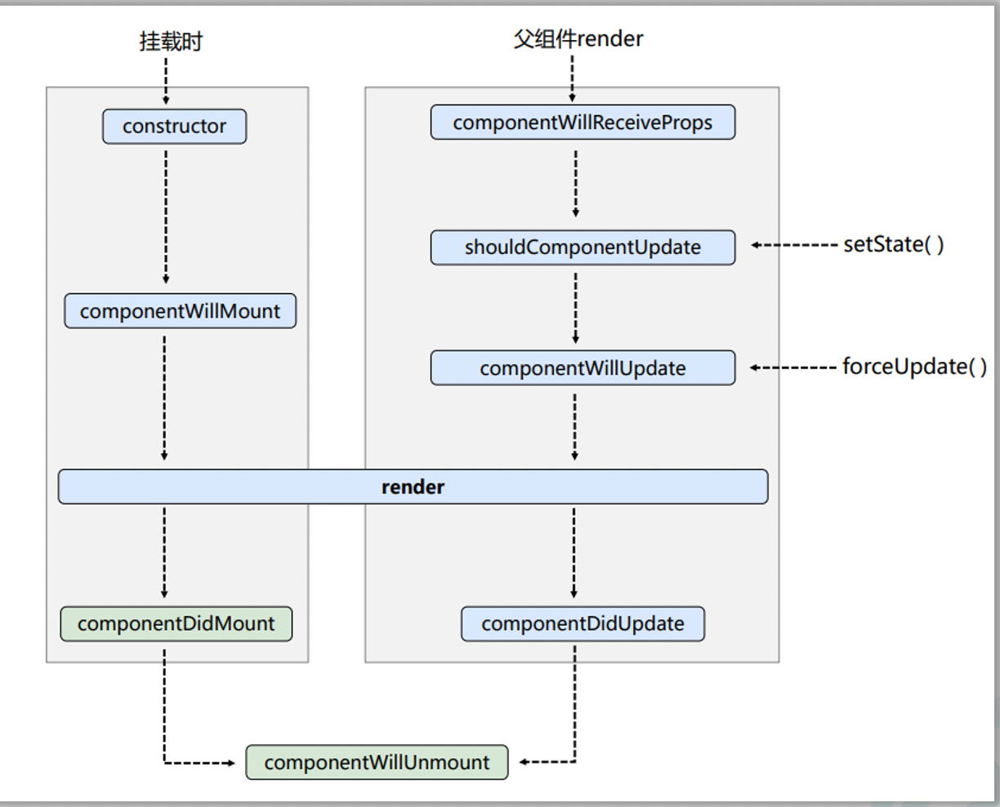
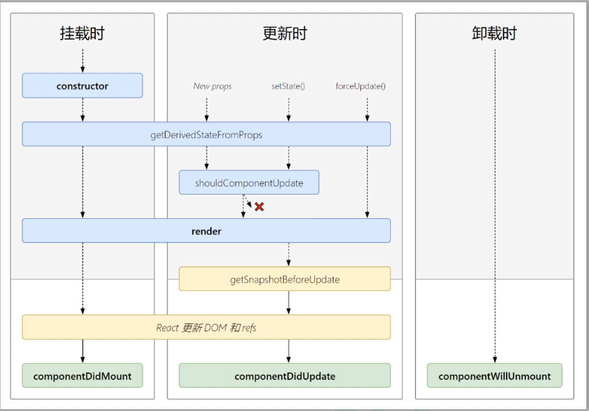
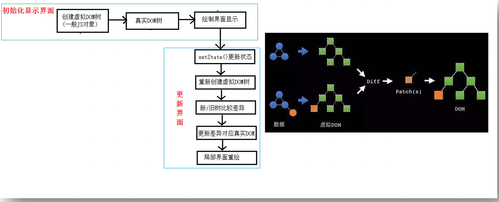

# React

#### 回调形式Ref调用次数

如果 `ref` 回调函数是以内联函数的方式定义

例如：

```<input ref={(c)=>{this.input1 = c;console.log('@',c);}} type="text"/>```

在更新过程中它会被执行两次，第一次传入参数 `null`，然后第二次会传入参数 DOM 元素。这是因为在每次渲染时会创建一个新的函数实例，所以 React 清空旧的 ref 并且设置新的。通过将 ref 的回调函数定义成 class 的绑定函数的方式可以避免上述问题，但是大多数情况下它是无关紧要的。


#### createRef创建ref容器

React.createRef调用后可以返回一个容器，该容器可以存储被ref所标识的节点,该容器是“专人专用”的

```myRef = React.createRef()```

``` <input ref = {this.myRef}/> ```


### React事件处理

1. 通过onXxx属性指定事件处理函数(注意大小写)

 a.React使用的是自定义(合成)事件, 而不是使用的原生DOM事件 —— 为了更好的兼容性

 b.React中的事件是通过事件委托方式处理的(委托给组件最外层的元素)——为了的高效

2. 通过event.target得到发生事件的DOM元素对象——不要过度使用ref


### 高阶函数

1. 若A函数，接收的参数是一个函数，那么A就可以称之为高阶函数。

2. 若A函数，调用的返回值依然是一个函数，那么A就可以称之为高阶函数。

  常见的高阶函数有：Promise、setTimeout、arr.map()等等

#### 函数的柯里化：

通过函数调用继续返回函数的方式，实现多次接收参数最后统一处理的函数编码形式。 

```javascript
		function sum(a) {
			return (b) => {
				return (c) => {
					return a + b + c
				}
			}
		}
		const res = sum(1)(2)(3);
```

高阶函数用例(统一函数编码形式，username,password函数统一写）：

```react
		class Login extends React.Component{
			//初始化状态
			state = {
				username:'', //用户名
				password:'' //密码
			}

			//保存表单数据到状态中
			saveFormData = (dataType)=>{
				return (event)=>{
					this.setState({[dataType]:event.target.value})
				}
			}

			//表单提交的回调
			handleSubmit = (event)=>{
				event.preventDefault() //阻止表单提交
				const {username,password} = this.state
				alert(`你输入的用户名是：${username},你输入的密码是：${password}`)
			}
			render(){
				return(
					<form onSubmit={this.handleSubmit}>
            用户名：<input onChange={this.saveFormData('username')} type="text" name="username"/>
						密码：<input onChange={this.saveFormData('password')} type="password" name="password"/>
						<button>登录</button>
					</form>
				)
			}
		}
```

不用柯里化实现：

```react
<input onChange={event => this.saveFormData('username',event) } type="text" name="username"/>
<input onChange={event => this.saveFormData('password',event) } type="password" name="password"/>
```


## React生命周期

旧版本：



​    **1.** **初始化阶段:** 由ReactDOM.render()触发---初次渲染

+ ``` constructor()```

+  ```componentWillMount()```

+  ```render()```

+  ```componentDidMount()```

​    **2.** **更新阶段:** 由组件内部this.setSate()或父组件重新render触发

+ ```shouldComponentUpdate()```

+ ```componentWillUpdate()```

+ ```render()```

+ ```componentDidUpdate()```

​    **3.** **卸载组件:** 由```ReactDOM.unmountComponentAtNode()```触发

+ ```componentWillUnmount()```

不想对状态更改也想更新 -- ```forceUpdate()```(不受阀门shouldComponentUpdate控制)

componentWillReceiveProps：组件将要接收新的props，第一次传入props不会调用，实际上钩子名字为componentWillReceiveNewProps

新版本：




## DOM的Diffing算法



1. react/vue中的key有什么作用？（key的内部原理是什么？）

   虚拟DOM中key的作用：

+ 简单的说: key是虚拟DOM对象的标识, 在更新显示时key起着极其重要的作用。

+ 详细的说: 当状态中的数据发生变化时，react会根据【新数据】生成【新的虚拟DOM】, 

​       随后React进行【新虚拟DOM】与【旧虚拟DOM】的diff比较，比较规则如下：

​      a. 旧虚拟DOM中找到了与新虚拟DOM相同的key：

​          若虚拟DOM中内容没变, 直接使用之前的真实DOM 

​          若虚拟DOM中内容变了, 则生成新的真实DOM，随后替换掉页面中之前的真实DOM

​      b. 旧虚拟DOM中未找到与新虚拟DOM相同的key

​          根据数据创建新的真实DOM，随后渲染到到页面


2. 为什么遍历列表时，key最好不要用index?

​      用index作为key可能会引发的问题：

+ 若对数据进行：逆序添加、逆序删除等破坏顺序操作:

​       会产生没有必要的真实DOM更新 ==> 界面效果没问题, 但效率低。

+  如果结构中还包含输入类的DOM：

​        会产生错误DOM更新 ==> 界面有问题。

+ 如果不存在对数据的逆序添加、逆序删除等破坏顺序操作，

​      仅用于渲染列表用于展示，使用index作为key是没有问题的。

​                  

3. 开发中如何选择key?:

+ 最好使用每条数据的唯一标识作为key, 比如id、手机号、身份证号、学号等唯一值。

+ 如果确定只是简单的展示数据，用index也是可以的。