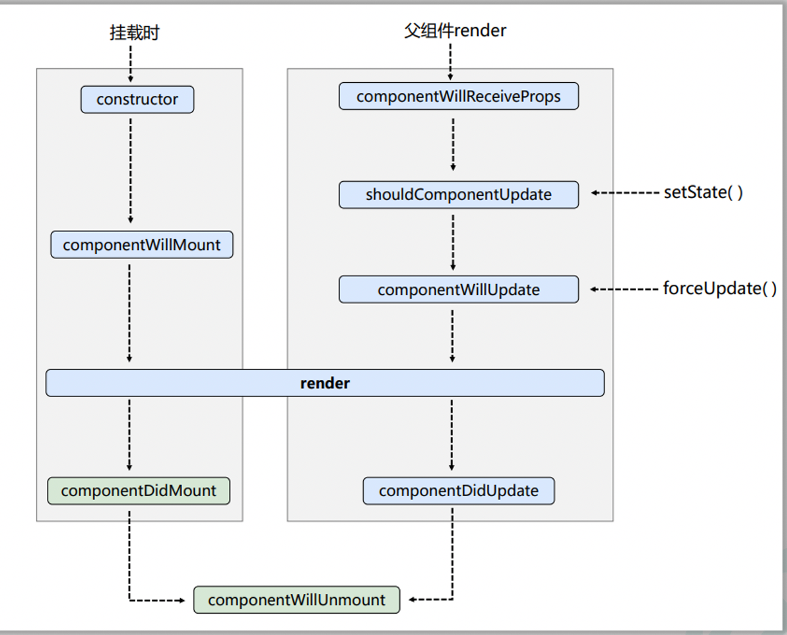
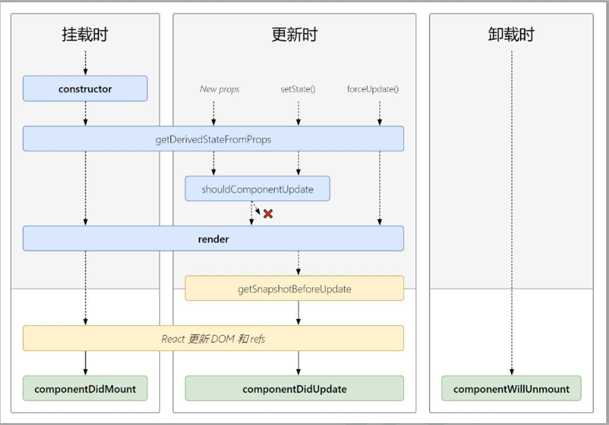
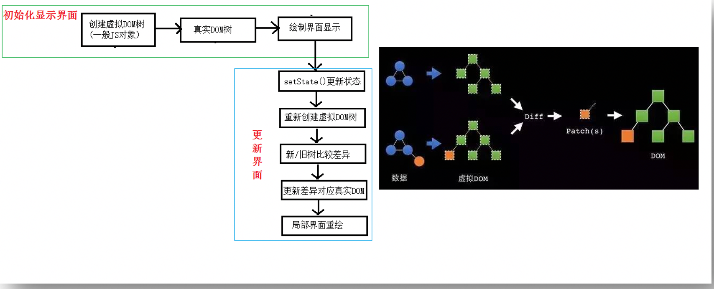
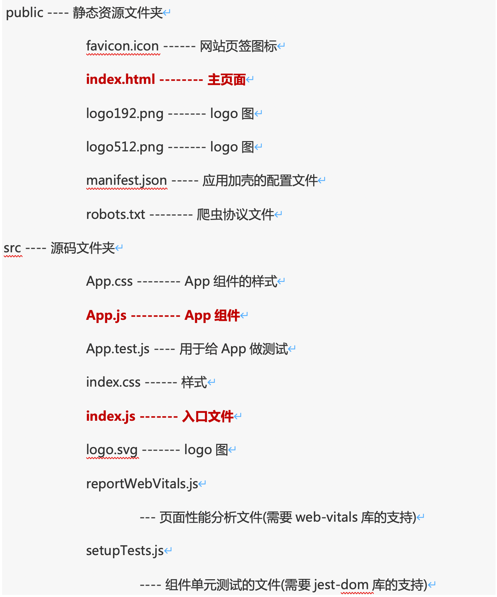

# React

React用于编写SPA（单页应用）

## Ref

#### 回调形式Ref调用次数

如果 `ref` 回调函数是以内联函数的方式定义

例如：

```<input ref={(c)=>{this.input1 = c;console.log('@',c);}} type="text"/>```

在更新过程中它会被执行两次，第一次传入参数 `null`，然后第二次会传入参数 DOM 元素。这是因为在每次渲染时会创建一个新的函数实例，所以 React 清空旧的 ref 并且设置新的。通过将 ref 的回调函数定义成 class 的绑定函数的方式可以避免上述问题，但是大多数情况下它是无关紧要的。


#### createRef创建ref容器

React.createRef调用后可以返回一个容器，该容器可以存储被ref所标识的节点,该容器是“专人专用”的

```myRef = React.createRef()```

``` <input ref = {this.myRef}/> ```


## React事件处理

1. 通过onXxx属性指定事件处理函数(注意大小写)

 a.React使用的是自定义(合成)事件, 而不是使用的原生DOM事件 —— 为了更好的兼容性

 b.React中的事件是通过事件委托方式处理的(委托给组件最外层的元素)——为了的高效

2. 通过event.target得到发生事件的DOM元素对象——不要过度使用ref


## 高阶函数

1. 若A函数，接收的参数是一个函数，那么A就可以称之为高阶函数。

2. 若A函数，调用的返回值依然是一个函数，那么A就可以称之为高阶函数。

  常见的高阶函数有：Promise、setTimeout、arr.map()等等

#### 函数的柯里化：

通过函数调用继续返回函数的方式，实现多次接收参数最后统一处理的函数编码形式。 

```javascript
		function sum(a) {
			return (b) => {
				return (c) => {
					return a + b + c
				}
			}
		}
		const res = sum(1)(2)(3);
```

高阶函数用例(统一函数编码形式，username,password函数统一写）：

```react
		class Login extends React.Component{
			//初始化状态
			state = {
				username:'', //用户名
				password:'' //密码
			}

			//保存表单数据到状态中
			saveFormData = (dataType)=>{
				return (event)=>{
					this.setState({[dataType]:event.target.value})
				}
			}

			//表单提交的回调
			handleSubmit = (event)=>{
				event.preventDefault() //阻止表单提交
				const {username,password} = this.state
				alert(`你输入的用户名是：${username},你输入的密码是：${password}`)
			}
			render(){
				return(
					<form onSubmit={this.handleSubmit}>
            用户名：<input onChange={this.saveFormData('username')} type="text" name="username"/>
						密码：<input onChange={this.saveFormData('password')} type="password" name="password"/>
						<button>登录</button>
					</form>
				)
			}
		}
```

不用柯里化实现：

```react
<input onChange={event => this.saveFormData('username',event) } type="text" name="username"/>
<input onChange={event => this.saveFormData('password',event) } type="password" name="password"/>
```


## React生命周期

旧版本：



​    **1.** **初始化阶段:** 由ReactDOM.render()触发---初次渲染

+ ``` constructor()```

+  ```componentWillMount()```

+  ```render()```

+  ```componentDidMount()```

​    **2.** **更新阶段:** 由组件内部this.setSate()或父组件重新render触发

+ ```shouldComponentUpdate()```

+ ```componentWillUpdate()```

+ ```render()```

+ ```componentDidUpdate()```

​    **3.** **卸载组件:** 由```ReactDOM.unmountComponentAtNode()```触发

+ ```componentWillUnmount()```

不想对状态更改也想更新 -- ```forceUpdate()```(不受阀门shouldComponentUpdate控制)

componentWillReceiveProps：组件将要接收新的props，第一次传入props不会调用，实际上钩子名字为componentWillReceiveNewProps

新版本：




## DOM的Diffing算法



1. react/vue中的key有什么作用？（key的内部原理是什么？）

   虚拟DOM中key的作用：

+ 简单的说: key是虚拟DOM对象的标识, 在更新显示时key起着极其重要的作用。

+ 详细的说: 当状态中的数据发生变化时，react会根据【新数据】生成【新的虚拟DOM】, 

​       随后React进行【新虚拟DOM】与【旧虚拟DOM】的diff比较，比较规则如下：

​      a. 旧虚拟DOM中找到了与新虚拟DOM相同的key：

​          若虚拟DOM中内容没变, 直接使用之前的真实DOM 

​          若虚拟DOM中内容变了, 则生成新的真实DOM，随后替换掉页面中之前的真实DOM

​      b. 旧虚拟DOM中未找到与新虚拟DOM相同的key

​          根据数据创建新的真实DOM，随后渲染到到页面


2. 为什么遍历列表时，key最好不要用index?

​      用index作为key可能会引发的问题：

+ 若对数据进行：逆序添加、逆序删除等破坏顺序操作:

​       会产生没有必要的真实DOM更新 ==> 界面效果没问题, 但效率低。

+  如果结构中还包含输入类的DOM：

​        会产生错误DOM更新 ==> 界面有问题。

+ 如果不存在对数据的逆序添加、逆序删除等破坏顺序操作，

​      仅用于渲染列表用于展示，使用index作为key是没有问题的。

​                  

3. 开发中如何选择key?:

+ 最好使用每条数据的唯一标识作为key, 比如id、手机号、身份证号、学号等唯一值。

+ 如果确定只是简单的展示数据，用index也是可以的。


## React-Staging

React-Staging项目结构




## React拓展

## 1. setState

### setState更新状态的2种写法

setState这个动作实际上是异步的（setState函数在js中同步执行，执行后react异步更新），所以有setState第二个参数，传入一个回调，异步更新后调用。

+ setState(stateChange, [callback])------对象式的setState
  1. stateChange为状态改变对象(该对象可以体现出状态的更改)
  2. callback是可选的回调函数, 它在状态更新完毕、界面也更新后(render调用后)才被调用

+ setState(updater, [callback])------函数式的setState
  1. updater为返回stateChange对象的函数。
  2. updater可以接收到state和props。
  3. callback是可选的回调函数, 它在状态更新、界面也更新后(render调用后)才被调用。

```react
		//函数式的setState
		this.setState( state => ( { count: state.count+1 } ) )
```


<hr/>


## 2. lazyLoad

### 路由组件的lazyLoad

```js
	//1.通过React的lazy函数配合import()函数动态加载路由组件 ===> 路由组件代码会被分开打包
	const Login = lazy(()=>import('@/pages/Login'))
	
	//2.通过<Suspense>指定在加载得到路由打包文件前显示一个自定义loading界面
	<Suspense fallback={<h1>loading.....</h1>}>
        <Switch>
            <Route path="/xxx" component={Xxxx}/>
            <Redirect to="/login"/>
        </Switch>
    </Suspense>
```


<hr/>


## 3. Hooks

#### 1. React Hook/Hooks是什么?

```
(1). Hook是React 16.8.0版本增加的新特性/新语法
(2). 可以让你在函数组件中使用 state 以及其他的 React 特性
```

#### 2. 三个常用的Hook

```
(1). State Hook: React.useState()
(2). Effect Hook: React.useEffect()
(3). Ref Hook: React.useRef()
```

#### 3. State Hook

```
(1). State Hook让函数组件也可以有state状态, 并进行状态数据的读写操作
(2). 语法: const [xxx, setXxx] = React.useState(initValue)  
(3). useState()说明:
        参数: 第一次初始化指定的值在内部作缓存
        返回值: 包含2个元素的数组, 第1个为内部当前状态值, 第2个为更新状态值的函数
(4). setXxx()2种写法:
        setXxx(newValue): 参数为非函数值, 直接指定新的状态值, 内部用其覆盖原来的状态值
        setXxx(value => newValue): 参数为函数, 接收原本的状态值, 返回新的状态值, 内部用其覆盖原来的状态值
```

#### 4. Effect Hook

```
(1). Effect Hook 可以让你在函数组件中执行副作用操作(用于模拟类组件中的生命周期钩子)
(2). React中的副作用操作:
        发ajax请求数据获取
        设置订阅 / 启动定时器
        手动更改真实DOM
(3). 语法和说明: 
        useEffect(() => { 
          // 在此可以执行任何带副作用操作
          return () => { // 在组件卸载前执行
            // 在此做一些收尾工作, 比如清除定时器/取消订阅等
          }
        }, [stateValue]) // 如果指定的是[], 回调函数只会在第一次render()后执行
    
(4). 可以把 useEffect Hook 看做如下三个函数的组合
        componentDidMount()
        componentDidUpdate()
    	componentWillUnmount() 
```

#### 5. Ref Hook

```
(1). Ref Hook可以在函数组件中存储/查找组件内的标签或任意其它数据
(2). 语法: const refContainer = useRef()
(3). 作用:保存标签对象,功能与React.createRef()一样
```


------


## 4. Fragment

### 使用

	<Fragment><Fragment>
	<></>

### 作用

> 可以不用必须有一个真实的DOM根标签了


<hr/>

## 5. Context

### 理解

> 一种组件间通信方式, 常用于【祖组件】与【后代组件】间通信

### 使用

```js
1) 创建Context容器对象：
	const XxxContext = React.createContext()  
	
2) 渲染子组时，外面包裹xxxContext.Provider, 通过value属性给后代组件传递数据：
	<xxxContext.Provider value={数据}>
		子组件
    </xxxContext.Provider>
    
3) 后代组件读取数据：

	//第一种方式:仅适用于类组件 
	  static contextType = xxxContext  // 声明接收context
	  this.context // 读取context中的value数据
	  
	//第二种方式: 函数组件与类组件都可以
	  <xxxContext.Consumer>
	    {
	      value => ( // value就是context中的value数据
	        要显示的内容
	      )
	    }
	  </xxxContext.Consumer>
```

### 注意

	在应用开发中一般不用context, 一般都用它的封装react插件


<hr/>


## 6. 组件优化

### Component的2个问题 

> 1. 只要执行setState(),即使不改变状态数据, 组件也会重新render() ==> 效率低
>
> 2. 只当前组件重新render(), 就会自动重新render子组件，纵使子组件没有用到父组件的任何数据 ==> 效率低

### 效率高的做法

>  只有当组件的state或props数据发生改变时才重新render()

### 原因

>  Component中的shouldComponentUpdate()总是返回true

### 解决

	办法1: 
		重写shouldComponentUpdate()方法
		比较新旧state或props数据, 如果有变化才返回true, 如果没有返回false
	办法2:  
		使用PureComponent
		PureComponent重写了shouldComponentUpdate(), 只有state或props数据有变化才返回true
		注意: 
			只是进行state和props数据的浅比较, 如果只是数据对象内部数据变了, 返回false  
			不要直接修改state数据, 而是要产生新数据
	项目中一般使用PureComponent来优化


<hr/>


## 7. render props

### 如何向组件内部动态传入带内容的结构(标签)?

	React中:
		使用children props: 通过组件标签体传入结构
		使用render props: 通过组件标签属性传入结构,而且可以携带数据，一般用render函数属性

### children props

	<A>
	  <B>xxxx</B>
	</A>
	{this.props.children}
	问题: 如果B组件需要A组件内的数据, ==> 做不到 

### render props

	<A render={(data) => <C data={data}></C>}></A>
	A组件: {this.props.render(内部state数据)}
	C组件: 读取A组件传入的数据显示 {this.props.data} 


<hr/>

## 8. 错误边界

#### 理解：

错误边界(Error boundary)：用来捕获后代组件错误，渲染出备用页面

#### 特点：

只能捕获后代组件生命周期产生的错误，不能捕获自己组件产生的错误和其他组件在合成事件、定时器中产生的错误

##### 使用方式：

getDerivedStateFromError配合componentDidCatch

```js
// 生命周期函数，一旦后台组件报错，就会触发
static getDerivedStateFromError(error) {
    console.log(error);
    // 在render之前触发
    // 返回新的state
    return {
        hasError: true,
    };
}

componentDidCatch(error, info) {
    // 统计页面的错误。发送请求发送到后台去
    console.log(error, info);
}
```


<hr/>


## 9. 组件通信方式总结

#### 组件间的关系：

- 父子组件
- 兄弟组件（非嵌套组件）
- 祖孙组件（跨级组件）

#### 几种通信方式：

		1.props：		(1).children props		(2).render props	2.消息订阅-发布：		pubs-sub、event等等	3.集中式管理：		redux、dva等等	4.conText:		生产者-消费者模式

#### 比较好的搭配方式：

		父子组件：props
		兄弟组件：消息订阅-发布、集中式管理
		祖孙组件(跨级组件)：消息订阅-发布、集中式管理、conText(开发用的少，封装插件用的多)

