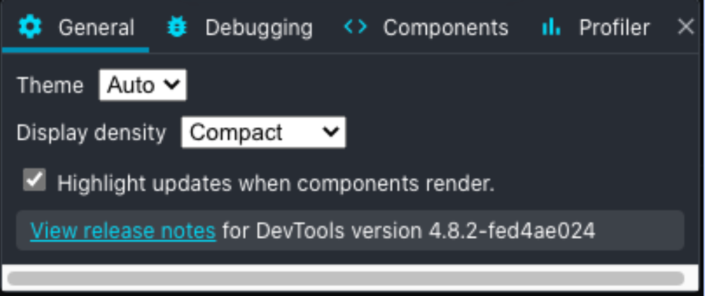

# React生态

### React DevTools

##### General 设置

General 面板中最重要的功能就是 **"Highlight updates when components render"**。勾选上之后，可以查看 React 重绘时，页面哪些部分有更新。在遇到性能问题时，可以快速帮助决策在哪部分不需要重绘的组件部分添加 React.memo 阻止重绘。

##### Debugging 设置

**"Append components stacks to console warnings and errors."**

可以帮助我们定位 React 报错信息来自哪个组件

#### Components 设置

**"Hide components where..."**

此项在过滤组件树时有用。比如，大多数应用可能会在顶层有很多 Context.Provider，就可以过滤 Context 类型、不显示。当我们只关心业务逻辑层的组件时，可以过滤掉 DOM 组件，减少树的节点

##### Profiler 设置

**"Record why each component rendered while profiling"**

勾选之后会在渲染火焰图的 hover 面板中看到 **"Why did this render"**。

##### 现在有哪些 render 原因呢？

+ **Props changed**

  ​     顾名思义，传入组件的 props 变更

+ **The parent component rendered**

  ​	父组件渲染导致的子组件渲染。一般要做性能优化都是找这类重绘原因的组件。但是要注意，如果组件中有用到 useContext，Provider 的 value 变更导致的重绘也是被标记为 The parent component rendered，需要注意

+ **Hooks changed**

  ​	Hook 状态变更导致的重绘，一般就是指 useState 返回的更新函数被调用了

+ **State changed**

  ​	这个只会在 class component 中有，大家忽略

+ **"Hide commits below xx (ms)"**

  ​	设置一个更新耗时的阈值，低于该阈值的渲染不显示。用来快速过滤哪些渲染有性能问题
  
  

##### React 组件检视器

用法和 DevTools 的元素面板类似，可以直接在页面上定位到元素对应的 React Component。并且可以实时查看当前组件内部的 hooks 状态，返回的组件树

右上角的四个图标

分别作用如下：

- 模拟 ReactLazy 懒加载组件 Suspense 状态
- 定位组件所渲染的 DOM 节点
- 在 Console 中打印 Component 内部状态
- 跳转到组件所在源文件（配合 sourcemap）

