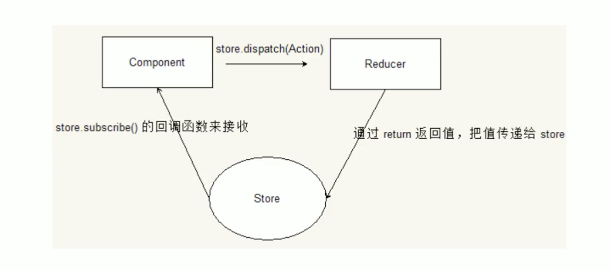
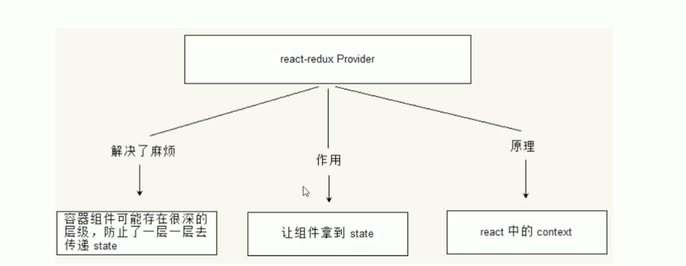
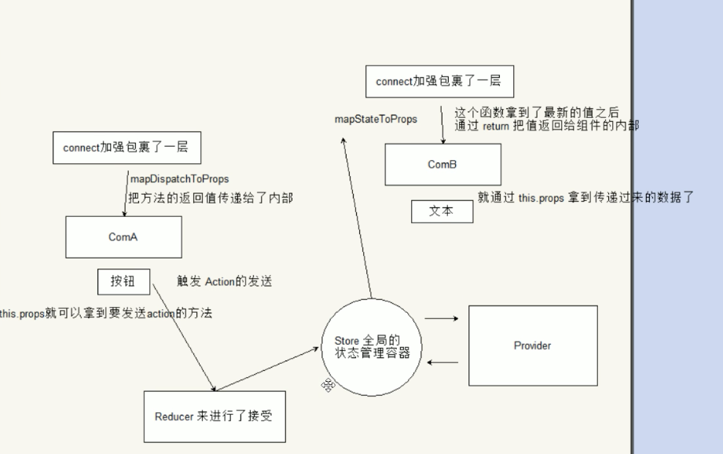

# Redux

+ Redux的设计思想

（1）Web 应用是一个状态机，视图与状态是一一对应的。

（2）所有的状态，保存在一个对象里面。


## Action

1. Action 就是 View 发出的通知，表示 State 应该要发生变化了。

2. Action 是一个对象，其中的`type`属性是必须的，表示 Action 的名称，Action 描述当前发生的事情。

3. 改变 State 的唯一办法，就是使用 Action。

可以定义一个函数来生成 Action，这个函数就叫 Action Creator，示例如下

```javascript
const sendAction = () => {
    return {
        type: 'send_type',
        value: 'action hello'
    }
}
```


## Reducer

1. Store 收到 Action 以后，必须给出一个新的 State，这样 View 才会发生变化。这种 State 的计算过程就叫做 Reducer。

2. Reducer 是一个函数，它接受 Action 和当前 State 作为参数，返回一个新的 State。

Demo:

```javascript
const initState = {
    value: 'init'
}
const reducer = (state = initState, action) => {
    console.log('reducer:', state, action);
    switch(action.type){
        case 'send_type':
            return Object.assign({}, state, action);
        default:
            return state;
    }
}
```


## Store

### StoreApi:

+ `store.subscribe()`: 添加一个变化监听器。每当 dispatch action 的时候就会执行，state 树中的一部分可能已经变化。你可以在回调函数里调用`getState()`来拿到当前 state。

+ `store.dispatch()`是 View 发出 Action 的唯一方法，将使用当前 `getState()`的结果和传入的 `action` 以同步方式的调用 store 的 reduce 函数。它的返回值会被作为下一个 state。从现在开始，这就成为了 `getState()`的返回值，同时变化监听器(change listener)会被触发。

  > 

+ 流程：

  组件 -- `store.dispatch(action)` -- 触发reducer的执行 -- 根据type区分返回的state -- 返回值给store -- 更新state -- `store.subscribe(listener)`中listener回调函数执行。




## React-redux




## provider


## connect

`connect`方法接受两个参数：`mapStateT.oProps`和`mapDispatchToProps`。它们定义了 UI 组件的业务逻辑。前者负责输入逻辑，即将`state`映射到 UI 组件的参数（`props`），后者负责输出逻辑，即将用户对 UI 组件的操作映射成 Action。

- ### `mapStateToProps`

  `mapStateToProps`是一个函数。它的作用就是像它的名字那样，建立一个从（外部的）`state`对象到（UI 组件的）`props`对象的映射关系。

  ```javascript
  const mapStateToProps = (state) => {
    return {
      todos: getVisibleTodos(state.todos, state.visibilityFilter)
    }
  }
  ```

  `mapStateToProps`会订阅 Store，每当`state`更新的时候，就会自动执行，重新计算 UI 组件的参数，从而触发 UI 组件的重新渲染。

  `mapStateToProps`的第一个参数总是`state`对象，还可以使用第二个参数，代表容器组件的`props`对象。

  `connect`方法可以省略`mapStateToProps`参数，那样的话，UI 组件就不会订阅Store，就是说 Store 的更新不会引起 UI 组件的更新。

  

- ### `mapDispatchToProps`

  `mapDispatchToProps`是`connect`函数的第二个参数，用来建立 UI 组件的参数到`store.dispatch`方法的映射

  如果`mapDispatchToProps`是一个函数，会得到`dispatch`和`ownProps`

  ```javascript
  const mapDispatchToProps = (
    dispatch,
    ownProps
  ) => {
    return {
      onClick: () => {
        dispatch({
          type: 'SET_VISIBILITY_FILTER',
          filter: ownProps.filter
        });
      }
    };
  }
  ```

  如果`mapDispatchToProps`是一个对象，它的每个键名也是对应 UI 组件的同名参数，键值应该是一个函数，会被当作 Action creator ，返回的 Action 会由 Redux 自动发出(dispatch).

  ```javascript
  const mapDispatchToProps = {
    onClick: (filter) => {
      type: 'SET_VISIBILITY_FILTER',
      filter: filter
    };
  }
  ```

  

  ## 计数器Demo：

  两个组件，按钮ComA和文本ComB，点击按钮+1，用react-redux实现通信的过程




